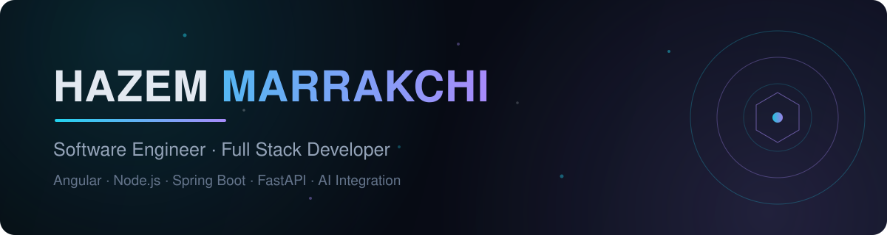

**Software Engineer & Full Stack Developer** based in Gabès, Tunisia — I design and build modern web platforms, and wire them to intelligence.

 

### Engineering Focus

- Full stack web platforms — **Angular / React** frontends, **Node.js · Spring Boot · FastAPI** backends
- **AI integration** in real products: prediction features with Scikit-learn on production data flows
- Service-oriented architecture, secure REST APIs, SQL/NoSQL data modeling
- EUR-ACE® accredited Software Engineering degree (ESSAT Gabès)

 

### Tech Stack

 

### Featured Project

| | |
|---|---|
| **[3D Interactive Portfolio](https://hazem-portfolio.vercel.app)** | Immersive WebGL experience built with React 19 + Three.js r185 — particle field, mouse-parallax camera, bilingual EN/FR, glassmorphism design system. `React` `Three.js` `TypeScript` `Tailwind` |

 

### GitHub Stats

 

### Contribution Snake

---

*Open to new opportunities — my inbox is open:* **hazemmrk12@gmail.com**
